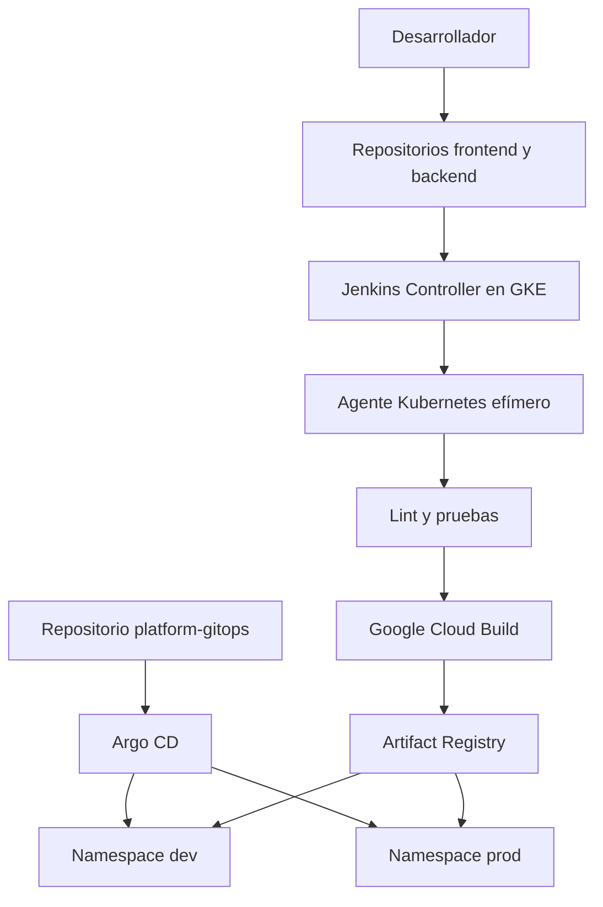

# Arquitectura de la plataforma

## Vista general

## Integración continua

Jenkins se encarga de comprobar y construir el software:

1. Obtiene el código desde GitHub.
2. Crea un Pod agente temporal en Kubernetes.
3. Instala las dependencias.
4. Ejecuta Ruff.
5. Ejecuta Pytest y la cobertura.
6. Solicita a Cloud Build la construcción de la imagen.
7. Cloud Build publica la imagen en Artifact Registry.
8. El agente temporal desaparece al terminar.

El Jenkins Controller coordina los trabajos, pero no ejecuta directamente el código de las aplicaciones.

## Entrega continua

Argo CD se encarga del despliegue:

1. Observa la rama main del repositorio platform-gitops.
2. Lee el overlay correspondiente al ambiente.
3. Compara Git con el estado real de GKE.
4. Aplica las diferencias.
5. Comprueba la salud de los recursos.
6. Corrige modificaciones manuales mediante selfHeal.

## Separación de responsabilidades

| Componente | Responsabilidad |
| --- | --- |
| GitHub | Código, historial y revisión mediante Pull Requests |
| Jenkins | Validación y coordinación de la integración continua |
| Agentes Kubernetes | Ejecución aislada y temporal de los pipelines |
| Cloud Build | Construcción de imágenes Docker |
| Artifact Registry | Almacenamiento de imágenes |
| Repositorio GitOps | Estado deseado de Kubernetes |
| Argo CD | Sincronización entre Git y GKE |
| GKE | Ejecución de frontend, backend, Jenkins y Argo CD |

## Ambientes

### Desarrollo

- Namespace: dev.
- Sincronizado por platform-demo-dev.
- Utilizado para validar el artefacto antes de promoverlo.

### Producción

- Namespace: prod.
- Sincronizado por platform-demo-prod.
- La promoción se registra mediante Pull Request.
- Utiliza el mismo digest previamente validado.

## Principio fundamental

La aplicación se construye una sola vez. El mismo artefacto se promueve entre ambientes sin reconstruirlo.

Esto garantiza trazabilidad, repetibilidad y evita que desarrollo y producción ejecuten imágenes diferentes.
